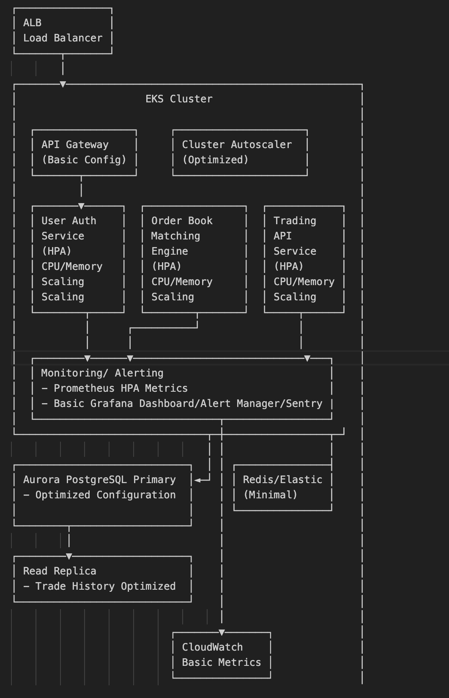

## Requirements
Building a system design for binance.com platform following some contraints below
* Resilient to failures, scalable, and cost-effective.
* Design the architecture, choose the appropriate technologies, and explain your approach for maintaining high availability and scalability

## Contraints 
Cloud Provider:  Amazon Web Services (AWS)
Throughput: 500 requests per second
Response Time: p99 response time of <100ms
-> Let me will make some assumptions 
* 500 RPS average (43.2 million requests per day)
* 24/7 operation (730 hours per month)
* Multi-AZ deployment across 3 AZs
* US East (N. Virginia) region pricing
* Moderate data transfer (10TB/month)
* 50% read/50% write ratio for databases

## Picked features ( I will pick 3 here)
* Spot Trading - Basic order book and matching for 2-3 trading pairs
* User Authentication - Simple login/account management
* Trading API - Essential REST endpoints for trading
  
## Simplify Design with 500 RPS (No need for message queue)

### Services
#### User Auth Service
* Handles user authentication
* Simple login/account management

#### Order Book Matching Engine
* Manages spot trading
* Handles order book logic
* Matching for 2-3 trading pairs

#### Trading API Service
* Provides essential REST endpoints
* Interfaces between frontend and backend services

It supports enough functionalities we need a system  we need with simplify enough and scalable go through some sections with some above constrainsts, and easily replace/enhance in case we wanna scale more.
### EKS
For considering about the scalable and complexity increase in the future including apply CI/CD, Argocd (GitOps), deploying more services and networking handling, using EKS could be a good candidate than using EC2.

### Main Api Gateway
Kong support a lot of plugins like Rate Limit, Cors, ... and have scalable easily, we can use the HTTP Route resources for A/B testing in case we wanna -> Could replace by Nginx Gateway if we wanna simply.

### Applications
 Applications can be deployment or statefulset with containerzation, which apply autoscaling ,so it will scale based on metrics like RPS/CPU/Memory, the dev need to understand the native of app for discussing with us which metrics and pod we need to scale

### Monitoring/Alerting
 We can use grafana/alerting which are open-source and can installing easily in EKS without so much costing comparing to cloud servces can integrating to multiple channels like Slack, including Sentry for stack trace errors, when issuing happens.

### Language 
Which those high perfomance like this p99 < 100ms, prefer using some low level/high peformance langagues like Rust, Go instead of nodejs or python is a must here.

### DBS
For contraint p99 < 100ms, I'm not 100% but trading history query can be problem, but with scope of 500 RPS and save costing, add replica here with optimize query and indexing, can help, in case it's scalable, we can reconsider, for choosing the other database for storing timeseries,... 
We also apply some caching layer here (Redis) with ElastiCache for caching and returing some infor like order/ Sessions which can cache and quickly return, with setting ttl 30-60s or the other validating cache if we has. Remember for update cache when update data from Primary DB (PSQL).

### Message Queue( Suggestion but not including with current scope)
Consider apply high through put Message Queue like Kafka in this system for making system more reliability like buffering during traffic spikes in high traffic, or we can retry the message and dedoupling scaling the workers/consumers with non-blocking.
### CLoud CDN (Apply when we storing a lot of contents in FE)
We can consider using cloudfront fror caching contetns in Frontend side which will otimize the UX

